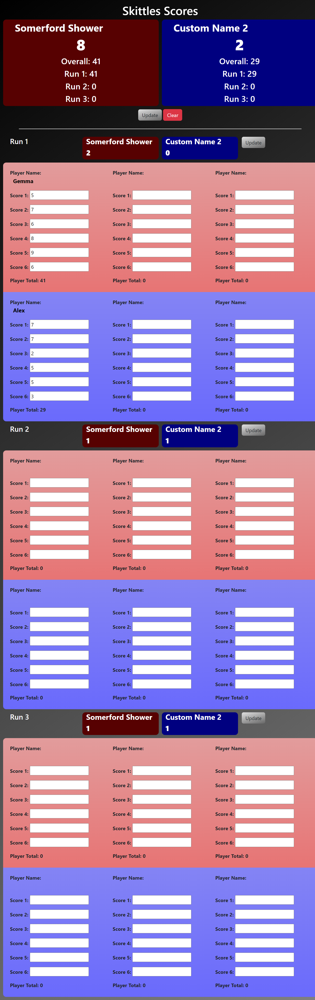

# Skittles-Scores

Simple App to keep track of Skittles scores. 

## Link to Site

https://daisyeverard.github.io/Skittles-Scores/

## Preview

## Table of Contents

- [Description](#description)
- [Usage](#usage)
- [Technologies](#technologies)
- [Future Development](#future-development-options)
- [Contacts](#contacts)

## Description

This is an app to calculate the points of a complete score.
This is based on a gameplay structure in which each leg/run is made of 3 players taking 6 turns each. 
The score is calculated based on a complete game, so will add 1 point to each team for
empty runs, and 4 points for overall high score

#### Rules

A skittles game is made of 3 runs (a.k.a. legs). Each team is made of 9 players. 
One turn is made up of 3 chances to throw a ball at 9 pins. 
The score is how many pins the player has knocked over at the end of the game. If all the pins are knocked down before the end of the turn, they are stuck back up until the player has thrown 3 balls. This means the maximum score on any turn is 27. 
For each leg, there are 2 points available for the highest combined team total of that leg. If the totals are equal, each team gets 1 points.
At the end of the game, there are an extra 4 points for overall highest total. If the overall totals are the same, each team gets 2 points. 

#### Scores and Points Displays
- The header has, for each team, the overall score, overall points, and points for each run. 
- The top of each run displays the points from that run. 
- Individual players can see their total under the scores from each turn. 

## Usage

- Change team names by clicking on the big red and blue banners at the top of the page
- Input player names and scores for each go individually
- on clicking any `update` button will save the data entered, and display scores and points. 
- on clicking and `clear` button, stored names and scores will be removed. Custom team names will remain. 

## Technologies

- HTML
- CSS
- Bootstrap
- JavaScript
- jQuery
- Local Storage / JSON

## Future Development Options

- Add a way to change the setup to a game where each run is each of the 9 players taking 2 turns each. 
- Not adding points to the score for empty runs

## Contacts

- GitHub: [DaisyEverard](https://github.com/DaisyEverard)
- LinkedIn: [daisy-everard](https://www.linkedin.com/in/daisy-everard/)
- Email: msdeverard@gmail.com

## License

MIT License

